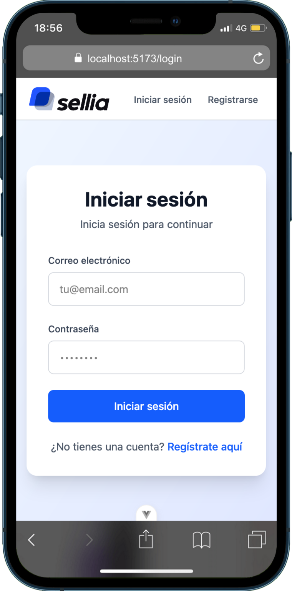
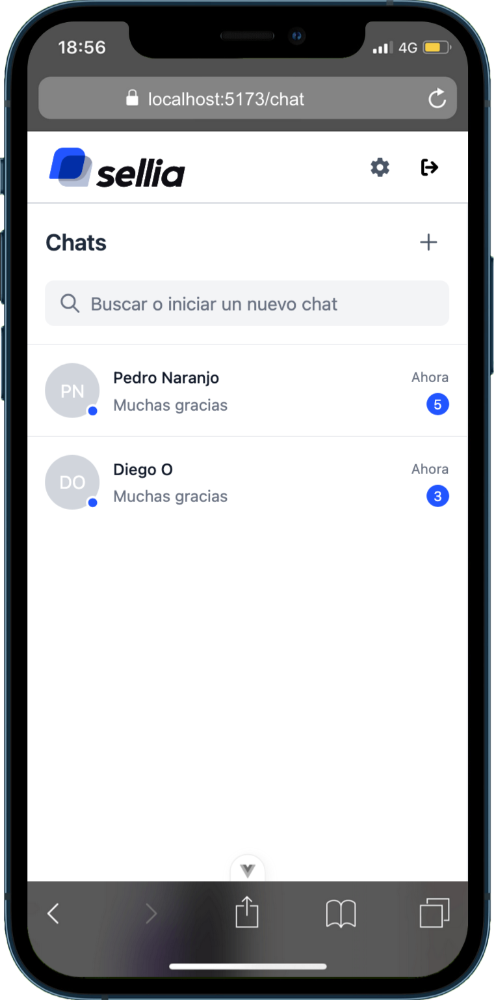
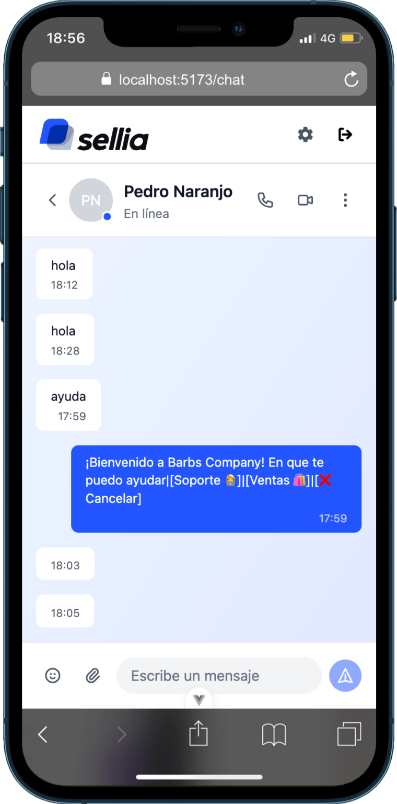
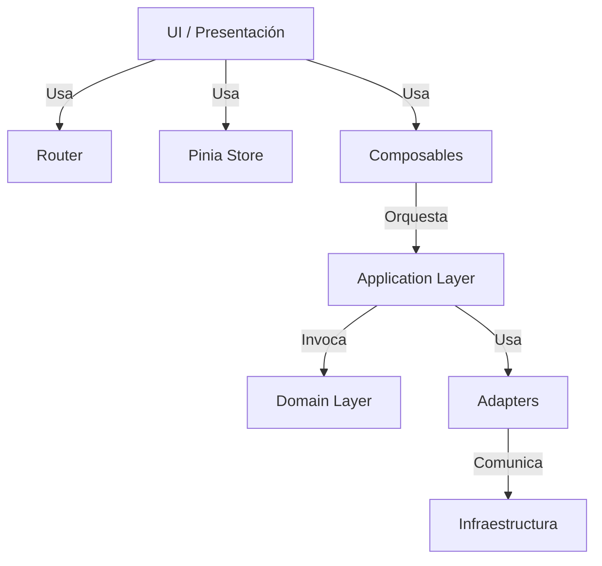
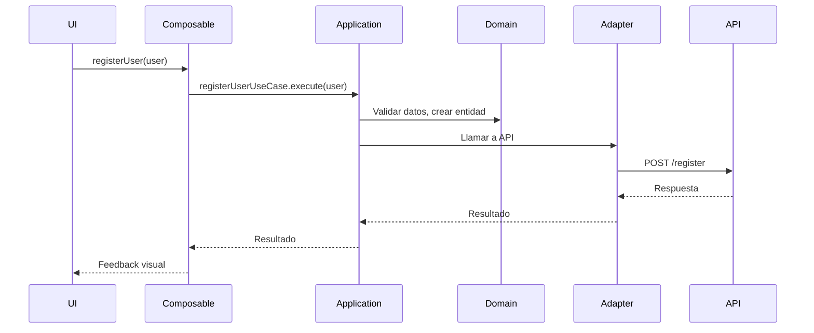
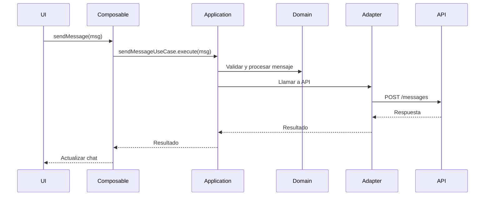
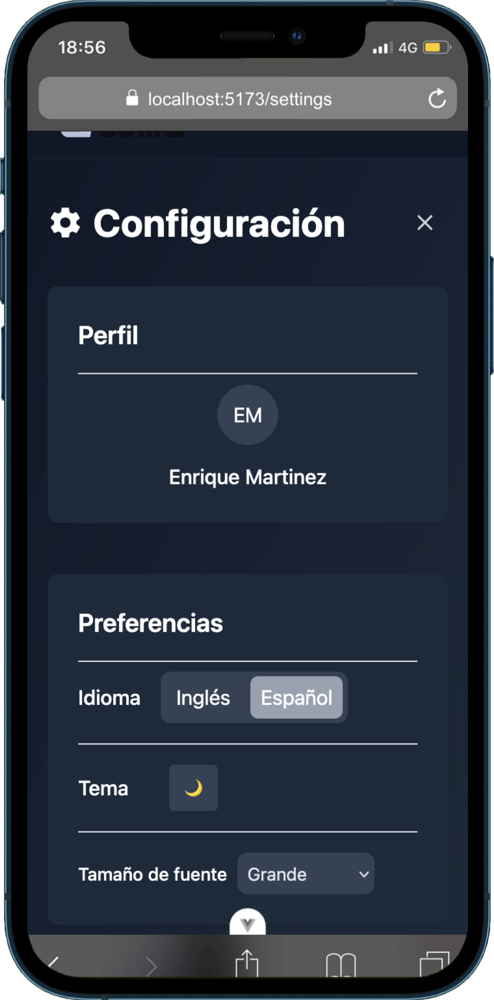
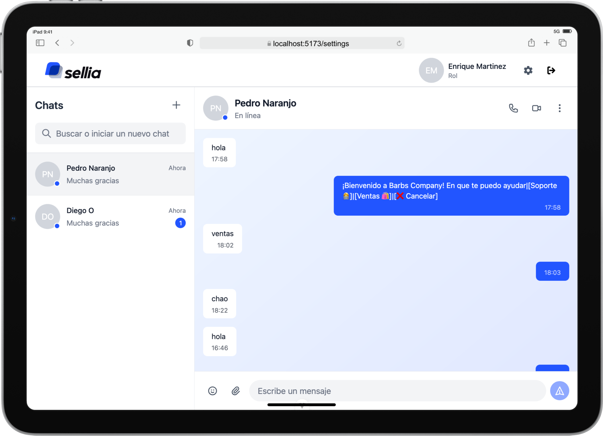

# Documentación Técnica: app-message-sellia

## Descripción General
app-message-sellia es una aplicación web de mensajería y gestión de usuarios, construida con Vue 3 y una arquitectura limpia y modular. El proyecto enfatiza la separación de responsabilidades, la escalabilidad y la mantenibilidad, integrando autenticación, chat, internacionalización y pruebas automatizadas.





---


## Arquitectura y Estructura de Carpetas

La arquitectura está basada en principios de Clean Architecture y DDD (Domain Driven Design), separando claramente la lógica de dominio, la infraestructura y la presentación:

### Diagrama de Capas



---

- **src/**
  - **App.vue, main.ts:** Entrada principal y bootstrap de la app.
  - **assets/**: Recursos estáticos y estilos globales.
  - **composables/**: Hooks reutilizables para lógica reactiva (ej. useUser, useDarkMode).
  - **modules/users/**: 
    - **domain/**: Entidades y lógica de negocio de usuario.
    - **application/**: Casos de uso y orquestación de lógica.
    - **adapters/**: Adaptadores para infraestructura y APIs.
  - **router/**: Definición de rutas y guards de navegación.
  - **stores/**: Pinia stores para gestión de estado global.
  - **types/**: Tipos y contratos TypeScript para mayor robustez.
  - **ui/components/**: Componentes UI organizados por atomicidad y vistas.
    - **atoms/**: Elementos básicos reutilizables.
    - **molecules/**: Combinaciones de átomos.
    - **chat/**: Componentes específicos de chat.
    - **icons/**: Iconos SVG personalizados.
    - **views/**: Vistas principales (ej. LoginView.vue, ChatView.vue).

Esta estructura permite que cada capa evolucione de forma independiente y facilita el testing y la extensión del sistema.

---

## Ejemplo de Flujo: Autenticación



---

## Ejemplo de Flujo: Envío de Mensaje en Chat



---


## Principales Tecnologías

<p align="left">
  
  
  
  
  
  
  
  
  
</p>

- **Vue 3** (Composition API) para UI reactiva y modular.
- **Pinia** para gestión de estado centralizada y tipada.
- **Vue Router** para navegación y protección de rutas.
- **Tailwind CSS** para estilos utilitarios y diseño responsive.
- **Vite** para desarrollo rápido y build eficiente.
- **Vitest** + **@vue/test-utils** para pruebas unitarias y de integración.
- **VeeValidate** para validación declarativa de formularios.
- **i18n** para internacionalización y soporte multilenguaje.
- **Zod** para validación y refuerzo de tipado en TypeScript, asegurando contratos robustos y seguros entre capas.

---

## Enfoque en la Arquitectura

- **Separación de capas:** La lógica de negocio (dominio) está aislada de la infraestructura y la presentación, permitiendo cambios y pruebas independientes.
- **Inyección de dependencias:** Los composables y casos de uso se inyectan mediante providers, facilitando el mocking y la reutilización.
- **Alias de rutas:** Uso de alias en Vite y TypeScript para importaciones limpias y mantenibles.
- **Testing robusto:** Pruebas unitarias y de componentes con mocks y stubs para aislar dependencias y simular escenarios reales.
- **Escalabilidad:** La estructura modular permite agregar nuevos módulos y funcionalidades sin afectar el núcleo del sistema.

---

## Funcionalidades Clave

### Autenticación
- Registro y login de usuarios con validación y feedback visual.
- Manejo de errores y estados de carga.

### Chat
- Componentes y vistas para chat en tiempo real.
- Scroll automático, skeleton loaders y diseño mobile-first.

### UI/UX
- Componentes atómicos y moleculares para máxima reutilización.
- Iconos SVG personalizados y skeleton loaders para mejor experiencia.

### Internacionalización
- Textos traducibles con `$t` y soporte para múltiples idiomas.
- Mock de `$t` en pruebas para aislar la lógica de UI.

### Testing
- Pruebas unitarias y de integración para composables y vistas.
- Mocks de dependencias (Pinia, i18n, providers) y stubs de componentes.
- Corrección de errores comunes: entorno DOM, mocks ESM, eventos en stubs.

---

## Configuración y Buenas Prácticas

### Alias
- Definidos en `vite.config.ts` y `tsconfig.json` para importaciones cortas y mantenibles (`@views`, `@composables`, etc.).


### Vitest
- Configurado con entorno `jsdom` en `vitest.config.ts` para simular el DOM en pruebas.
- Pruebas ubicadas en `src/test/composables/` y `src/test/views/`.

### Mocks y Stubs
- Mock de `inject` para composables y providers.
- Mock de `$t` para i18n en vistas.
- Stubs de componentes para aislar la lógica de UI.

### Ejemplo de Test de Composable
```typescript
vi.mock('vue', async () => {
  const actual = await vi.importActual<typeof import('vue')>('vue')
  return {
    ...actual,
    inject: () => mockUserProvider
  }
})
```

### Ejemplo de Test de Vista
```typescript
wrapper = mount(LoginView, {
  global: {
    stubs: ['Form', 'InputText', 'Button'],
    mocks: { $t: (msg: string) => msg }
  }
})
```

---


## Accesibilidad

- La aplicación incluye modo oscuro, permitiendo a los usuarios alternar entre tema claro y oscuro para mayor comodidad visual.
- Se puede cambiar el tamaño de la fuente desde la interfaz, facilitando la lectura para personas con baja visión o preferencias de accesibilidad.




---

## Buenas Prácticas
- Mantener la separación de lógica de dominio, infraestructura y presentación.
- Usar mocks y stubs para aislar dependencias y facilitar el testing.
- Utilizar alias para rutas cortas y mantenibles.
- Configurar entorno DOM para pruebas de componentes.
- Documentar y tipar todos los contratos y entidades, reforzando el tipado con Zod para mayor seguridad y robustez.

---


## Requisitos para Desarrollo

Para instalar y ejecutar el proyecto en tu ambiente local, sigue estos pasos:

1. **Instala Node.js y npm**
   - Requiere Node.js >= 18 y npm >= 9
   - Descarga desde [nodejs.org](https://nodejs.org/)

2. **Clona el repositorio**
   ```sh
   git clone https://github.com/QuiqueM/app-message-sellia.git
   cd app-message-sellia
   ```

3. **Instala las dependencias**
   ```sh
   npm install
   ```

4. **Ejecuta el servidor de desarrollo**
   ```sh
   npm run dev
   ```
   Esto iniciará la aplicación en modo desarrollo. Abre el navegador en la URL que aparece en consola (por defecto: http://localhost:5173).

5. **Ejecuta los tests**
   ```sh
   npm run test
   ```
   Esto ejecutará todas las pruebas unitarias y de componentes.


---

## Contacto y Mantenimiento
- Owner: QuiqueM
- Rama principal: main

---

## Notas
- El proyecto está preparado para escalar y agregar nuevos módulos sin afectar el núcleo.
- La arquitectura limpia y modular facilita la mantenibilidad, el testing y la evolución del sistema.
